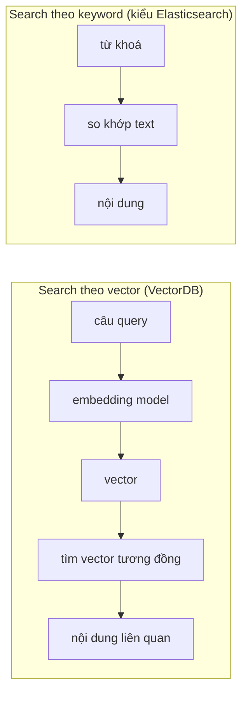
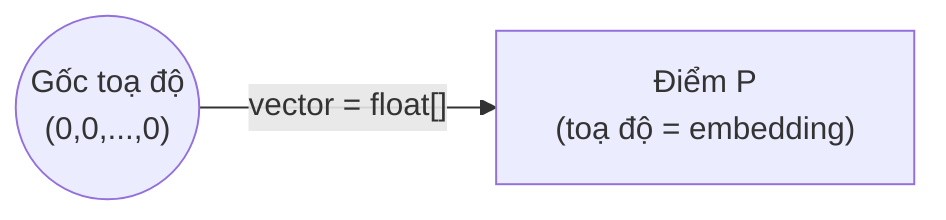
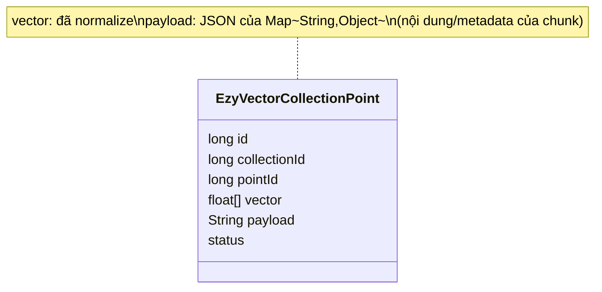
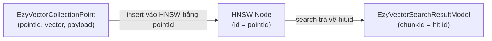
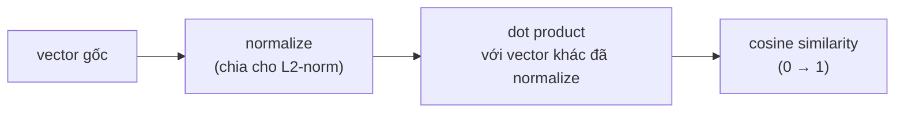
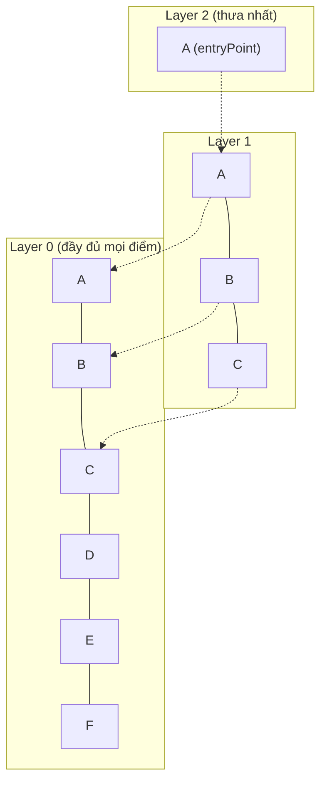
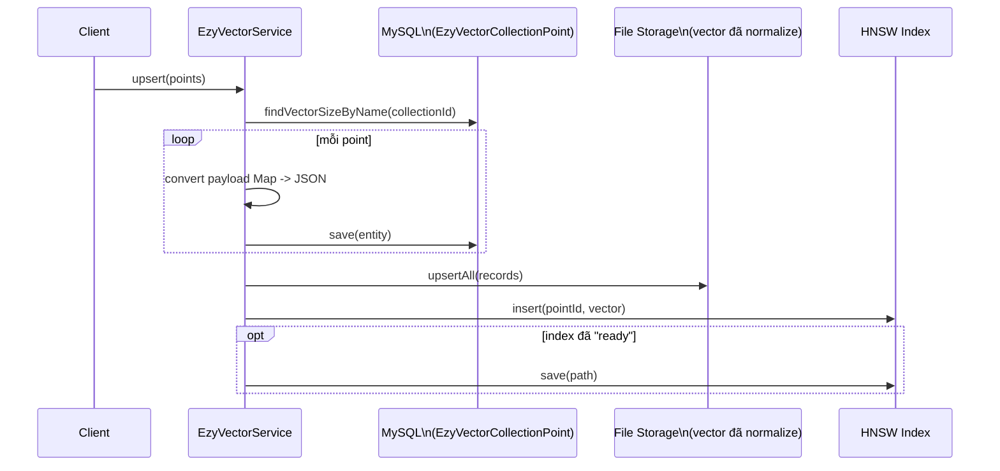
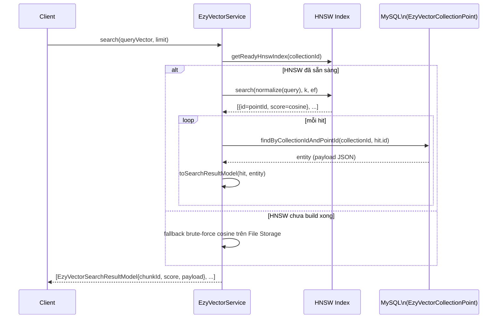

# Vector Database là gì?

Nếu anh em đang dùng Qdrant hay mấy cái vector DB có sẵn thì cũng không cần quan tâm bài này lắm. Nhưng không có lý do gì mà mình lại không tò mò xem Vector DB nó thật sự là cái gì, nó có phức tạp đến mức mình không thể làm chủ công nghệ này không. Trong bài này tôi sẽ đi từ ý tưởng cơ bản nhất, rồi soi vào cách `ezyvector` (project mình đang tự viết) hiện thực nó.

# Ý tưởng cốt lõi

Cơ bản thì Vector Database là một dịch vụ hỗ trợ tìm kiếm, và kết quả của nó hiện tại có phần vượt trội hơn so với search theo keyword hay một số thuật toán mình hay dùng trong Elasticsearch.

Ý tưởng rất đơn giản: thay vì ánh xạ **từ khoá → nội dung** như search truyền thống, nó ánh xạ **vector → mảnh nội dung**. Khi tìm kiếm, câu query sẽ được biến thành một vector, sau đó áp dụng một thuật toán nào đó tối ưu để tìm ra các vector tương đồng nhất, từ đó lấy được mảnh nội dung liên quan.

Điểm khác biệt lớn nhất: keyword search so khớp *chữ*, còn vector search so khớp *ý nghĩa* — vì embedding model được huấn luyện để những câu có nghĩa gần nhau thì có vector gần nhau trong không gian.

# Tại sao một mảng `float[]` lại gọi là "vector"?

Sẽ có nhiều bạn thắc mắc: mình chỉ ánh xạ một mảng `float[]`, tức là toạ độ của **một điểm** trong không gian N chiều, vậy tại sao lại gọi nó là "vector" — trong khi vector về mặt hình học phải là đoạn nối **hai điểm**?

Câu trả lời: trong toán học, nếu ta cố định gốc toạ độ O(0,0,...,0), thì vector đi từ O đến một điểm P bất kỳ được xác định *duy nhất* bởi toạ độ của P. Người ta gọi đây là **vector vị trí (position vector)**. Vì gốc toạ độ luôn ngầm hiểu là cố định, nên chỉ cần lưu toạ độ điểm (mảng `float[]`) là đủ để biết vector đó — không cần lưu "điểm đầu, điểm cuối" tường minh.

Vì vậy trong cùng một mảng số, hai cách gọi tồn tại song song mà không mâu thuẫn:

- Gọi là **vector** khi nói về phép toán đại số (cosine similarity, dot product...) — đây là lý do có tên "vector DBMS".
- Gọi là **point** khi nói về vị trí lưu trữ trong không gian — đây cũng là tên entity ở tầng lưu trữ/index (mỗi node trong đồ thị HNSW là một "điểm").

# Trong `ezyvector`, "chunk" chính là "point"

Một câu hỏi hay gặp khác: chunk (mảnh nội dung) được ánh xạ với vector hay với point?

Trong `ezyvector` hiện tại, **không có** entity `Chunk` hay `Vector` tách rời. Toàn bộ dữ liệu nằm gọn trong một entity duy nhất: `EzyVectorCollectionPoint`.

Khi trả kết quả search, id trả về cho client được gọi là `chunkId`, nhưng thực chất chính là `pointId` đã insert vào HNSW:

Nói cách khác: `chunkId == pointId`. "Chunk" chỉ là tên gọi ở tầng business/API cho cùng một point, không phải một object trung gian riêng.

# Đo độ tương đồng: Cosine similarity

Cũng có nhiều thuật toán đo độ tương đồng giữa các vector, nhưng trong dự án này mình chọn **Cosine similarity** — một thuật toán tương đối đơn giản và quen thuộc: đo góc giữa hai vector, càng gần 0 độ (cos càng gần 1) thì càng tương đồng.

Cách làm trong `ezyvector`: chuẩn hoá (normalize) vector về độ dài 1 trước, sau đó cosine similarity chỉ còn là **dot product**:

Bên trong HNSW, để tối thiểu hoá (thay vì tối đa hoá), người ta lưu `distance = 1 - cosine`, rồi khi trả kết quả lại đổi ngược `score = 1 - distance` để có cosine similarity gốc.

# HNSW — cấu trúc index để tìm nhanh trong hàng triệu vector

Nếu chỉ so sánh vector query với *toàn bộ* vector đã lưu (brute-force) thì với dữ liệu lớn sẽ rất chậm. `ezyvector` dùng **HNSW (Hierarchical Navigable Small World)** — một cấu trúc đồ thị đa tầng giúp tìm gần đúng (approximate nearest neighbor) rất nhanh.

Ý tưởng: các điểm được sắp vào nhiều "tầng" (layer). Tầng trên cùng rất thưa, chỉ có vài điểm, dùng để nhảy nhanh qua không gian. Càng xuống tầng dưới, mật độ điểm càng dày, đến tầng 0 thì chứa đầy đủ tất cả các điểm.

Mỗi node trong đồ thị lưu: `id` (chính là `pointId`), `vector` đã normalize, `level` (tầng cao nhất mà node này xuất hiện — sinh ngẫu nhiên theo phân phối mũ, càng lên cao xác suất càng thấp), và danh sách neighbor ở từng tầng.

Chi tiết về HNSW chúng ta hãy dành cho một bài viết khác nhé.

# Luồng insert một chunk (end-to-end)

# Luồng search một câu query (end-to-end)

# Nhược điểm của Vector DB

Không có gì miễn phí, dùng Vector DB thì mình phải đánh đổi vài thứ:

- **Tốn thêm chi phí embedding**: mỗi lần lưu hay tìm kiếm đều phải gọi qua một embedding model (tự host hoặc gọi API), tốn thêm một bước xử lý và một khoản chi phí mà search truyền thống không có.
- **Tốn tài nguyên lưu trữ và RAM**: mỗi chunk giờ phải cõng thêm một mảng `float[]` vài trăm đến vài nghìn chiều, nhân với số lượng bản ghi thì dung lượng tăng lên đáng kể; HNSW muốn nhanh thì cũng cần load kha khá dữ liệu (graph + vector) vào RAM.
- **Mất cấu trúc dữ liệu gốc**: dữ liệu bị phân mảnh và chỉ giữ lại phần "có nghĩa" để embedding, ví dụ các thẻ HTML, format, style thường bị bỏ đi — nên vẫn phải lưu thêm một bản gốc ở nơi khác nếu sau này cần khôi phục nguyên văn.
- **Kết quả chỉ là gần đúng (ANN)**: HNSW đánh đổi độ chính xác lấy tốc độ, nên không đảm bảo luôn tìm ra đúng top-k tương đồng nhất tuyệt đối (recall < 100%) — với một số bài toán cần chính xác tuyệt đối thì đây là rủi ro.
- **Khó giải thích (explainability thấp)**: kết quả "vì sao A giống B" nằm trong một mô hình embedding dạng hộp đen, không dễ debug hay giải thích cho người dùng cuối như một câu SQL hay một keyword match tường minh.
- **Phụ thuộc hoàn toàn vào chất lượng embedding model**: model kém hoặc không hợp domain thì search kém, mà đổi sang model khác (để nâng cấp chất lượng) thường phải re-embed lại toàn bộ dữ liệu cũ — chi phí migrate không nhỏ.
- **Filter/kết hợp điều kiện phức tạp còn hạn chế**: so với SQL truyền thống, việc vừa lọc theo điều kiện chính xác (ví dụ theo ngày, theo trạng thái) vừa tìm tương đồng vector cùng lúc thường kém linh hoạt và kém tối ưu hơn.

# Tương lai của Vector DB sẽ đi về đâu?

Dù có những nhược điểm kể trên, khả năng tìm kiếm theo ngữ nghĩa của Vector DB là không phải bàn cãi — nó vượt trội hơn hẳn so với search truyền thống, mà nhu cầu tìm kiếm lại là tối quan trọng đối với hầu hết mọi hệ thống. Vậy nên mình nghĩ Vector DB sẽ dần trở nên phổ biến, trở thành một lựa chọn phổ thông không kém gì MySQL hay Elasticsearch bây giờ, và cũng là một dòng sản phẩm mới cho các đơn vị cung cấp hạ tầng.

Một vài hướng đi có thể thấy rõ:

- **Hybrid search lên ngôi**: kết hợp keyword search (chính xác, giải thích được) với vector search (bắt được ngữ nghĩa) trong cùng một query, bù trừ nhược điểm cho nhau thay vì chọn một trong hai.
- **Tích hợp thẳng vào database truyền thống** thay vì phải chạy một hệ thống riêng: Postgres có `pgvector`, MySQL và Elasticsearch cũng đã có vector field/dense vector — xu hướng là giảm số lượng hệ thống phải vận hành song song.
- **Tối ưu chi phí lưu trữ/RAM**: các kỹ thuật nén vector (quantization), giảm chiều mà vẫn giữ chất lượng tìm kiếm sẽ tiếp tục được cải tiến để giảm bớt cái giá phải trả ở mục nhược điểm.
- **Đa phương thức (multi-modal)**: không chỉ text, mà ảnh, âm thanh, video cũng được embedding vào cùng một không gian vector để tìm kiếm chéo (ví dụ tìm ảnh bằng câu mô tả).

# Tổng kết

- VectorDB thay "so khớp chữ" bằng "so khớp ý nghĩa" thông qua embedding vector.
- Một mảng `float[]` vừa là **toạ độ của một điểm**, vừa là **vector vị trí** tính từ gốc toạ độ — hai cách gọi cho cùng một dữ liệu.
- Trong `ezyvector`, chunk, point và vector thực chất gộp chung vào một entity (`EzyVectorCollectionPoint`); `chunkId` chỉ là tên gọi khác của `pointId`.
- Độ tương đồng được đo bằng cosine similarity (dot product sau khi normalize).
- HNSW là cấu trúc đồ thị đa tầng giúp việc tìm kiếm gần đúng nhanh hơn nhiều so với brute-force, đánh đổi lấy một chút độ chính xác.

Nắm được từng mảnh này rồi thì VectorDB không còn là hộp đen nữa — nó chỉ là sự kết hợp của: embedding, một phép đo khoảng cách, và một cấu trúc dữ liệu để tìm kiếm nhanh trên phép đo đó.
